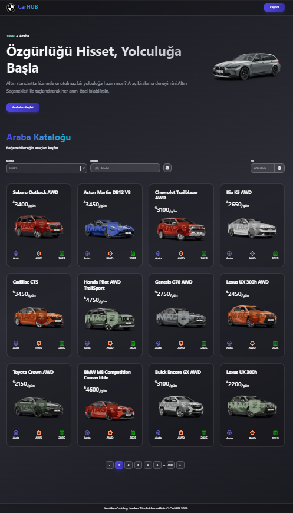

<h1 align="center">🚗 Car Rental TS</h1>

  TypeScript ve React kullanılarak geliştirilmiş modern araç kiralama uygulamasıdır.
  Araç listeleme, marka/model filtreleme, detay görüntüleme ve sayfalama özelliklerini sunar.

<h2>📌 Proje Amacı</h2>

Bu proje, React ile bileşen tabanlı mimariyi ve TypeScript ile tip güvenli geliştirme pratiğini uygulamak amacıyla geliştirilmiştir.
Gerçek bir araç kiralama arayüzünü simüle ederek filtreleme, modalize edilmiş detay görünümü ve harici API entegrasyonunu kapsamaktadır.

<ul>
  <li>Harici araç API'si ile gerçek zamanlı veri</li>
  <li>TypeScript ile tip güvenli geliştirme</li>
  <li>React Router DOM ile sayfa yönlendirme</li>
  <li>Marka ve modele göre araç filtreleme</li>
  <li>Yıl ve yakıt tipi bazlı gelişmiş filtreleme</li>
  <li>Motion animasyonlu modal ile araç detay görüntüleme</li>
  <li>rc-pagination ile sayfalama</li>
  <li>Yeniden kullanılabilir component mimarisi</li>
  <li>Responsive ve modern kullanıcı arayüzü</li>
</ul>

<h2>🛠️ Kullanılan Teknolojiler</h2>

<ul>
  <li>React</li>
  <li>TypeScript</li>
  <li>React Router DOM</li>
  <li>Motion (Framer Motion)</li>
  <li>Axios</li>
  <li>TailwindCSS</li>
  <li>rc-pagination</li>
  <li>Vite</li>
</ul>

<h2>✨ Öne Çıkan Özellikler</h2>

<ul>
  <li>Marka ve model bazlı araç arama ve filtreleme</li>
  <li>Yıl ve yakıt tipi filtresi</li>
  <li>Animasyonlu modal ile araç detayı (görseller + bilgiler)</li>
  <li>rc-pagination ile ürün listesi sayfalama</li>
  <li>Axios ile harici REST API entegrasyonu</li>
  <li>Loading durumu yönetimi</li>
  <li>Hata durumu yönetimi (Error component)</li>
  <li>Tip güvenli props ve state yönetimi (TypeScript)</li>
</ul>

<h2>📂 Proje Yapısı</h2>

<pre>
car-rental-ts/
│
├── public/
│   ├── calendar.svg
│   ├── close.svg
│   ├── favicon.svg
│   ├── hero.png
│   ├── icons.svg
│   ├── logo.png
│   ├── model-icon.png
│   ├── search.svg
│   ├── steering-wheel.svg
│   └── tire.svg
│
├── src/
│   ├── components/
│   │   ├── button/
│   │   │   └── index.tsx
│   │   ├── card/
│   │   │   ├── car-info.tsx
│   │   │   └── index.tsx
│   │   ├── container/
│   │   │   └── index.tsx
│   │   ├── error/
│   │   │   └── index.tsx
│   │   ├── filter/
│   │   │   ├── index.tsx
│   │   │   ├── searchbar.tsx
│   │   │   └── year.tsx
│   │   ├── footer/
│   │   │   └── index.tsx
│   │   ├── header/
│   │   │   └── index.tsx
│   │   ├── hero/
│   │   │   └── index.tsx
│   │   ├── list/
│   │   │   └── index.tsx
│   │   ├── loading/
│   │   │   └── index.tsx
│   │   └── modal/
│   │       ├── images.tsx
│   │       ├── index.tsx
│   │       └── info.tsx
│   │
│   ├── pages/
│   │   └── home/
│   │       └── index.tsx
│   │
│   ├── types/
│   │   └── index.ts
│   │
│   ├── utils/
│   │   ├── constant.ts
│   │   ├── formatData.ts
│   │   ├── getImage.ts
│   │   ├── getPrice.ts
│   │   └── service.ts
│   │
│   ├── App.tsx
│   ├── index.css
│   └── main.tsx
│
├── .gitignore
├── eslint.config.js
├── image7.gif
├── image.png
├── index.html
├── package-lock.json
├── package.json
├── README.md
├── tsconfig.app.json
├── tsconfig.json
├── tsconfig.node.json
└── vite.config.ts
</pre>

<h2>📸 Proje Önizleme</h2>

  

<h2>🎥 Demo (GIF)</h2>

  

<h2>🚀 Kurulum</h2>

Projeyi klonlayın:

<pre>
git clone https://github.com/kenansonmez1617-hub/car-rental-ts.git
</pre>

Proje klasörüne girin:

<pre>
cd car-rental-ts
</pre>

Bağımlılıkları yükleyin:

<pre>
npm install
</pre>

Projeyi çalıştırın:

<pre>
npm run dev
</pre>

<h2>🔮 Geliştirilebilir Özellikler</h2>

<ul>
  <li>Kullanıcı kimlik doğrulama sistemi</li>
  <li>Araç rezervasyon ve kiralama akışı</li>
  <li>Favori araçlar listesi</li>
  <li>Dark / Light Mode desteği</li>
  <li>Gelişmiş fiyat filtresi (aralık seçimi)</li>
  <li>Karşılaştırma özelliği (araç vs araç)</li>
  <li>Backend entegrasyonu ve özel API</li>
  <li>RTK Query ile veri yönetimi</li>
</ul>

<h2>👨‍💻 Geliştirici</h2>

  <strong>Kenan Sönmez</strong> 
  Frontend Developer

GitHub: 
<a href="https://github.com/kenansonmez1617-hub" target="_blank">
https://github.com/kenansonmez1617-hub
</a>

LinkedIn: 
<a href="https://www.linkedin.com/in/kenan-sonmez" target="_blank">
https://www.linkedin.com/in/kenan-sonmez
</a>

<h2>📄 Lisans</h2>

  Bu proje eğitim ve portfolyo amaçlı geliştirilmiştir.
  İncelenebilir ve geliştirilebilir.

  ⭐ Projeyi beğendiyseniz GitHub üzerinden yıldız bırakabilirsiniz.

